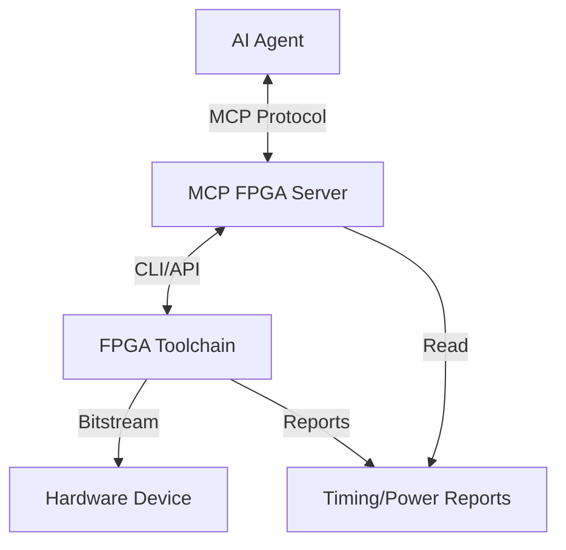

# MCP FPGA Agent Server

This repository contains the architecture and reference implementation for an MCP (Model Context Protocol) server designed to empower AI agents to develop, verify, and deploy FPGA designs.

## Architecture

The system is designed to close the loop between coding and hardware execution.



### Components

1.  **MCP Server (`server.py`)**: The entry point that exposes tools and resources to the AI agent.
2.  **Tools**:
    *   `synthesize_design`: Runs synthesis and implementation (e.g., Vivado/Quartus flow).
    *   `run_verification`: Executes testbenches (e.g., Verilator/Xsim/ModelSim).
    *   `analyze_design`: Extracts metrics (Timing, Power, Utilization).
    *   `flash_fpga`: Programs the physical device (e.g., OpenOCD, Vivado Lab).
3.  **Resources**:
    *   `fpga://logs/synthesis`: Access to build logs for error analysis.
    *   `fpga://reports/status`: High-level state of the current design.
4.  **System Prompt**: A guided persona definition to ensure the agent follows standard FPGA engineering workflows (Simulate -> Synthesize -> Analyze -> Flash).

## Installation

1.  Clone this repository.
2.  Install dependencies:
    ```bash
    pip install -r requirements.txt
    ```
3.  Ensure your FPGA vendor tools (Vivado, Quartus, etc.) are in your system PATH (mocked in this reference impl).

## Usage

### Running the Server

```bash
python mcp-fpga-agent/server.py
```

### Connecting an Agent

To use this with an MCP-compliant agent (like Claude Desktop or an IDE):

1.  Add the server configuration to your agent's config:

    ```json
    {
      "mcpServers": {
        "fpga-agent": {
          "command": "python",
          "args": ["/absolute/path/to/mcp-fpga-agent/server.py"]
        }
      }
    }
    ```

2.  Provide the System Prompt from `prompts/system_prompt.md` to the agent's context. This ensures it understands:
    *   The importance of simulation before hardware.
    *   How to interpret timing constraints.
    *   The iterative nature of hardware design.

## Extension

To connect to real tools:
1.  Modify `server.py` (or move logic to `tools/` modules).
2.  Replace the mock strings with `subprocess.run` calls to your vendor CLI (e.g., `vivado -mode batch ...`).
3.  Parse the generated report files (XML/Text) to return structured data in `analyze_design`.
